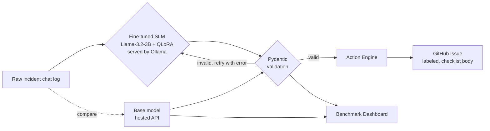

# Enterprise Incident Synthesizer & Action Engine

Turns chaotic incident chat logs into structured, schema-validated post-mortems — automatically — using a fine-tuned Small Language Model, then files the result straight into GitHub as an actionable ticket.

**Track 1: AI Models & Optimization** · Hackathon project

---

## Table of Contents

- [What This Is](#what-this-is)
- [Features](#features)
- [Architecture](#architecture)
- [Repo Structure](#repo-structure)
- [Prerequisites](#prerequisites)
- [Setup — Run It Locally, End to End](#setup--run-it-locally-end-to-end)
- [Deploying to GCP (Cloud Run)](#deploying-to-gcp-cloud-run)
- [Environment Variables](#environment-variables)
- [Current Benchmark Results](#current-benchmark-results)
- [What We Built](#what-we-built)
- [Known Limitations](#known-limitations)
- [Roadmap](#roadmap)

---

## What This Is

During a production incident, the chat log *is* the incident record — and it's usually never turned into a real post-mortem, because doing that by hand is slow and easy to skip. This project fine-tunes a small (3B) language model to read a raw incident chat transcript and output a strict, schema-validated JSON post-mortem — severity, root cause, timeline, action items — which then gets automatically filed as a labeled GitHub issue.

A benchmarking dashboard compares the fine-tuned model against the untouched base model on JSON validity, latency, and throughput, so the fine-tuning story is backed by actual numbers, not a demo alone.

## Features

- **Domain-adapted SLM** — Llama-3.2-3B, fine-tuned with QLoRA (4-bit, via Unsloth) on synthetic incident data
- **Schema-enforced output** — Pydantic validation with a self-healing retry loop (invalid output is fed back to the model with the specific error, not just re-asked blindly)
- **Swappable model backend** — the same pipeline runs against a hosted API or the local fine-tuned model via one function; used to isolate logic bugs from training issues during development
- **Automated Action Engine** — validated post-mortems become real, labeled GitHub issues with a formatted summary, timeline, and checklist of action items
- **Mention-safety guard** — synthetic names in generated content are prevented from rendering as live @mentions of real GitHub users
- **Benchmarking dashboard** — Streamlit UI comparing base vs. fine-tuned model on a held-out test set
- **Containerized and cloud-hosted** — runs locally via Docker Compose, or deployed to Google Cloud Run (steps below)
- **Runs on commodity hardware** — 4-bit quantization + GGUF export means the fine-tuned model runs on CPU, no GPU required at inference time

## Architecture



**Local:** three containers (Ollama, API, dashboard) wired together with `docker-compose.yml`.

**Cloud (GCP):** Ollama and the FastAPI app run **bundled in a single Cloud Run service** (`incident-api`) — Cloud Run doesn't cleanly support the same multi-container networking Docker Compose does, so the model server and the API share one container instead. The fine-tuned model weights live in Cloud Storage and are pulled down at container startup rather than baked into the image. The dashboard deploys as a **second, separate** Cloud Run service that calls the API's public URL.

## Repo Structure

```
incident-synth/
├── schema.py               # Pydantic schema for the post-mortem JSON
├── pipeline.py             # call_model (hosted) + call_model_local (Ollama) + validate_with_retry
├── generate_data.py        # synthetic (transcript, post-mortem) pair generation
├── action_engine.py        # turns validated JSON into a GitHub issue
├── actions_check.py        # end-to-end smoke test: pipeline -> action engine
├── eval.py                 # base vs. fine-tuned benchmark harness
├── dashboard.py             # Streamlit UI (local version)
├── data/
│   ├── incident_train.jsonl
│   └── incident_test.jsonl     # held-out, never used in training
├── models/
│   ├── Modelfile             # Ollama config (chat template, stop tokens, temperature)
│   └── incident-slm.gguf     # fine-tuned model weights (not committed — see below)
├── backend/                   # self-contained Cloud Run build context for the API
│   ├── main.py, schema.py, pipeline.py, action_engine.py   # copies, kept in sync manually
│   ├── download_model.py      # pulls the .gguf from Cloud Storage at container startup
│   ├── entrypoint.sh          # starts Ollama + the API, runs model setup in the background
│   ├── models/Modelfile
│   ├── requirements.txt
│   └── Dockerfile
├── dashboard/                  # self-contained Cloud Run build context for the dashboard
│   ├── dashboard.py
│   ├── requirements.txt
│   └── Dockerfile
├── docker-compose.yml         # local: ollama + api + dashboard together
├── .env                       # API keys / tokens (not committed)
└── .gitignore
```

> **Model weights and `.env` are intentionally not committed** — the `.gguf` file is ~2GB, and `.env` holds real credentials. `backend/` and `dashboard/` are separate, self-contained copies of the relevant files because each is its own Docker build context — Cloud Build only sees what's inside the folder you point it at, not the rest of the repo. If you change `schema.py`, `pipeline.py`, or `action_engine.py` at the root, copy the changes into `backend/` too before redeploying.

## Prerequisites

- Python 3.10+
- A hosted LLM API key (used for data generation and as the "base model" comparison — currently wired for Gemini)
- [Ollama](https://ollama.com/download) — serves the fine-tuned model locally, CPU is fine
- A Google Colab account (free tier) — for the actual fine-tuning run, which needs a GPU
- A GitHub account, a **sandbox repo** (don't point this at a real project repo), and a Personal Access Token with `repo` scope
- [Docker Desktop](https://www.docker.com/products/docker-desktop/) — optional, for a local containerized run (requires hardware virtualization enabled; see [Deploying to GCP](#deploying-to-gcp-cloud-run) for a no-local-Docker alternative)
- A Google Cloud account + the [gcloud CLI](https://cloud.google.com/sdk/docs/install) — only needed for cloud deployment

## Setup — Run It Locally, End to End

**1. Clone and set up the environment**
```bash
git clone <your-repo-url>
cd incident-synth
python3 -m venv .venv
source .venv/bin/activate        # Windows: .venv\Scripts\activate
pip install -r requirements.txt
```

**2. Configure secrets** — create a `.env` file in the project root:
```
GEMINI_API_KEY=your-gemini-key
GITHUB_TOKEN=your-github-pat
GITHUB_REPO=yourusername/incident-sandbox
```

**3. Confirm the schema works**
```bash
python -c "from schema import Postmortem; print('schema OK')"
```

**4. Generate the training dataset**
```bash
python generate_data.py
```
Produces `data/incident_train.jsonl`. Split off a held-out test set before training:
```bash
python -c "
import json, random
random.seed(42)
lines = open('data/incident_train.jsonl').readlines()
random.shuffle(lines)
test_n = max(1, len(lines) // 6)
open('data/incident_test.jsonl','w').writelines(lines[:test_n])
open('data/incident_train.jsonl','w').writelines(lines[test_n:])
"
```

**5. Fine-tune the model** (in Google Colab, not locally — this step needs a GPU)
- Open a new Colab notebook, set the runtime to a T4 GPU
- Upload `data/incident_train.jsonl`
- Install Unsloth, load `unsloth/Llama-3.2-3B-Instruct-bnb-4bit`, attach LoRA adapters, and train
- Export with `model.save_pretrained_gguf(...)` and download the resulting `.gguf` file plus the auto-generated `Modelfile`

**6. Serve the fine-tuned model locally**
```bash
mkdir -p models
# move the downloaded .gguf and Modelfile into models/
cd models
ollama create incident-slm -f Modelfile
ollama run incident-slm "Say hello in one sentence."   # smoke test
cd ..
```

**7. Run the pipeline**
```bash
python pipeline.py
```

**8. Test the Action Engine end to end**
```bash
python actions_check.py
```

**9. Run the evaluation harness**
```bash
python eval.py
```

**10. Launch the dashboard**
```bash
streamlit run dashboard.py
```

**11. (Optional) Run everything containerized, locally**
```bash
docker compose up --build
```
Requires Docker Desktop with hardware virtualization enabled. If that's not available on your machine, use Cloud Build in the next section instead of local Docker for the cloud path — no local Docker daemon required at all.

## Deploying to GCP (Cloud Run)

This deploys `incident-api` (Ollama + the fine-tuned model + the FastAPI app, bundled in one container) and `incident-dashboard` (a second, separate service) to Cloud Run. Replace every `YOUR_PROJECT_ID` / bucket / repo placeholder below with your own values — nothing here is meant to be copy-pasted with real values still in it.

**1. Project setup**
```bash
gcloud config set project YOUR_PROJECT_ID
gcloud services enable run.googleapis.com artifactregistry.googleapis.com storage.googleapis.com secretmanager.googleapis.com cloudbuild.googleapis.com
```

**2. Upload the model to Cloud Storage** (kept out of the container image — it's ~2GB, downloaded at startup instead)
```bash
gcloud storage buckets create gs://YOUR_PROJECT_ID-incident-models --location=us-central1
gcloud storage cp models/incident-slm.gguf gs://YOUR_PROJECT_ID-incident-models/incident-slm.gguf
```

**3. Store secrets in Secret Manager** — not as plain environment variables, and not with a trailing newline (see the gotcha below):
```bash
printf '%s' "your-github-token" | gcloud secrets create github-token --data-file=-
printf '%s' "your-gemini-key" | gcloud secrets create gemini-api-key --data-file=-
```
> **Gotcha:** `echo "text" | ...` (and PowerShell's `echo`) append a trailing newline to the secret's content by default, which then gets sent as part of the value — this breaks anything that puts the secret into an HTTP header (like the GitHub API client), with an error like `Invalid header value: '...\r\n'`. `printf '%s'` (bash) writes the value with no trailing newline. On Windows PowerShell, use `[System.IO.File]::WriteAllText("token.tmp", "your-token", [System.Text.Encoding]::ASCII)` and `--data-file=token.tmp` instead.

**4. Grant the Cloud Run service account access** to the bucket and secrets:
```bash
PROJECT_NUMBER=$(gcloud projects describe YOUR_PROJECT_ID --format="value(projectNumber)")
SERVICE_ACCOUNT="${PROJECT_NUMBER}-compute@developer.gserviceaccount.com"

gcloud storage buckets add-iam-policy-binding gs://YOUR_PROJECT_ID-incident-models \
  --member="serviceAccount:${SERVICE_ACCOUNT}" --role="roles/storage.objectViewer"
gcloud secrets add-iam-policy-binding github-token \
  --member="serviceAccount:${SERVICE_ACCOUNT}" --role="roles/secretmanager.secretAccessor"
gcloud secrets add-iam-policy-binding gemini-api-key \
  --member="serviceAccount:${SERVICE_ACCOUNT}" --role="roles/secretmanager.secretAccessor"
```

**5. Build via Cloud Build** — not local `docker build`. This builds in the cloud and needs no local Docker daemon or hardware virtualization at all:
```bash
gcloud builds submit --tag us-central1-docker.pkg.dev/YOUR_PROJECT_ID/incident-synth/api:v1 ./backend
```

**6. Deploy the API:**
```bash
gcloud run deploy incident-api \
  --image us-central1-docker.pkg.dev/YOUR_PROJECT_ID/incident-synth/api:v1 \
  --region us-central1 \
  --memory 8Gi --cpu 4 \
  --timeout 600 \
  --concurrency 1 \
  --no-cpu-throttling --cpu-boost \
  --set-env-vars "MODEL_BUCKET=YOUR_PROJECT_ID-incident-models,MODEL_BLOB=incident-slm.gguf,GITHUB_REPO=yourusername/incident-sandbox" \
  --set-secrets "GITHUB_TOKEN=github-token:latest,GEMINI_API_KEY=gemini-api-key:latest" \
  --allow-unauthenticated
```
> **`--no-cpu-throttling --cpu-boost` is not optional.** By default, Cloud Run throttles CPU for a container down to near-zero the moment its startup probe succeeds, allocating real CPU only while actively handling a request. The model download and `ollama create` happen in the background, *after* the API has already started (deliberately, so Cloud Run's startup check passes quickly) — without this flag, that background work gets starved of CPU and can stall indefinitely with no error at all. This was the single hardest bug to diagnose in this whole deployment; don't drop the flag on a future redeploy.

Get the deployed URL:
```bash
gcloud run services describe incident-api --region us-central1 --format="value(status.url)"
```

**7. Deploy the dashboard** as a second service, pointed at the API's real URL from Step 6:
```bash
gcloud builds submit --tag us-central1-docker.pkg.dev/YOUR_PROJECT_ID/incident-synth/dashboard:v1 ./dashboard

gcloud run deploy incident-dashboard \
  --image us-central1-docker.pkg.dev/YOUR_PROJECT_ID/incident-synth/dashboard:v1 \
  --region us-central1 \
  --set-env-vars "API_URL=https://your-actual-incident-api-url" \
  --allow-unauthenticated
```

**8. Verify end to end:**
```bash
curl -X POST https://your-actual-incident-api-url/synthesize \
  -H "Content-Type: application/json" \
  -d '{"transcript": "14:02 @raj: 500s on checkout... 14:14 @sam: root cause DB pool exhausted"}'
```
The first request after a cold start takes longer (model download + registration, roughly a minute) — this is normal. Subsequent requests are inference-time only.

**Troubleshooting notes from getting this working:**
- **Container fails the startup probe entirely:** almost always means something in the container is blocking before `uvicorn` binds to `$PORT`. Structure the entrypoint so the API starts first, in the background, with the slow model setup happening after it — not before.
- **`ollama create` fails with `no FROM line` or similar:** check that `backend/models/Modelfile` actually has content — files created via redirected shell output can end up empty; `Get-Content` / `cat` it before rebuilding to confirm.
- **A working local Ollama install still fails in the container with a tensor/offset error on an otherwise valid file:** check for an Ollama version mismatch between your local install and whatever the container's install script pulls; pin the container's version to match (`OLLAMA_VERSION=x.y.z sh` in the install command) if needed.
- **Logs look identical across multiple debugging attempts:** double-check you're querying the *current* revision name (`gcloud run revisions list --sort-by=~metadata.creationTimestamp --limit=1`), not a stale one from a previous deploy.

## Environment Variables

| Variable | Used by | Purpose |
|---|---|---|
| `GEMINI_API_KEY` | `pipeline.py`, `generate_data.py` | Hosted model calls (data generation, base-model comparison) |
| `GITHUB_TOKEN` | `action_engine.py` | Auth for creating issues |
| `GITHUB_REPO` | `action_engine.py` | Target repo, format `username/repo-name` |
| `MODEL_BUCKET` | `backend/download_model.py` (cloud only) | Cloud Storage bucket holding the `.gguf` |
| `MODEL_BLOB` | `backend/download_model.py` (cloud only) | Object name of the `.gguf` inside the bucket |
| `API_URL` | `dashboard/dashboard.py` (cloud only) | Public URL of the deployed `incident-api` service |

## Current Benchmark Results

Measured on an 8-example held-out test set (small — see [Limitations](#known-limitations)):

| Model | JSON Pass Rate | Avg. Latency |
|---|---|---|
| Base (hosted API) | 100% | 15.7s |
| Fine-tuned (local, CPU) | 100% | 108.8s |

Both models produce schema-valid output reliably at this sample size. The latency gap is expected and confirmed genuine (not a cold-start artifact, checked via per-call timing) — it reflects local CPU inference vs. accelerated cloud hardware, which is the real trade-off being made in exchange for running fully in-house, at no per-token cost, with deterministic output.

## What We Built

- Locked a Pydantic schema for the post-mortem structure and used it as a hard validation gate everywhere downstream
- Generated a synthetic training dataset (varied by severity, root cause, and incident style) after establishing that real incident logs weren't usable
- Built a validate-and-retry pipeline, proven against a hosted model first, then swapped to the fine-tuned local model with a one-function change
- Fine-tuned Llama-3.2-3B with QLoRA via Unsloth on a free Colab GPU, exported to GGUF, and served it locally through Ollama
- Built the Action Engine, including a fix for a real issue where synthetic names were rendering as live mentions of real GitHub users
- Ran a real base-vs-fine-tuned evaluation and built a dashboard to visualize it
- Containerized the full stack and deployed it live to Google Cloud Run (API + dashboard as separate services, model weights pulled from Cloud Storage at startup)

## Known Limitations

- **Held-out test set is small (8 examples)** — the 100% pass rate is accurate but not yet a strong statistical claim; worth growing before treating it as conclusive
- **Manual trigger only** — the pipeline runs on demand (paste a transcript, call the endpoint); no automated trigger from Slack/Teams/incident-management tools yet
- **Mentions are fully neutralized, not selectively allowed** — real teammate names currently render as plain text like everything else, rather than becoming real, intentional @mentions
- **GitHub only** — no Jira integration yet
- **`backend/` and `dashboard/` are manually-synced copies** of the root-level Python files, since each is a separate Docker build context — a change at the root doesn't automatically propagate; worth consolidating with a shared library or a build step later

## Roadmap

- Grow the training and test sets for more robust benchmark numbers
- Jira integration alongside GitHub
- Automated triggers (Slack slash command, or a webhook off an incident-management tool) instead of manual invocation
- Allowlist-based mention handling — real teammates get real @mentions, everything else stays plain text
- Constrained decoding (e.g. via Outlines or Instructor) to guarantee schema-valid output without needing the retry loop
- GitHub Actions CI/CD: build and deploy automatically on push
- De-duplicate `backend/`/`dashboard/` from the root-level source files
